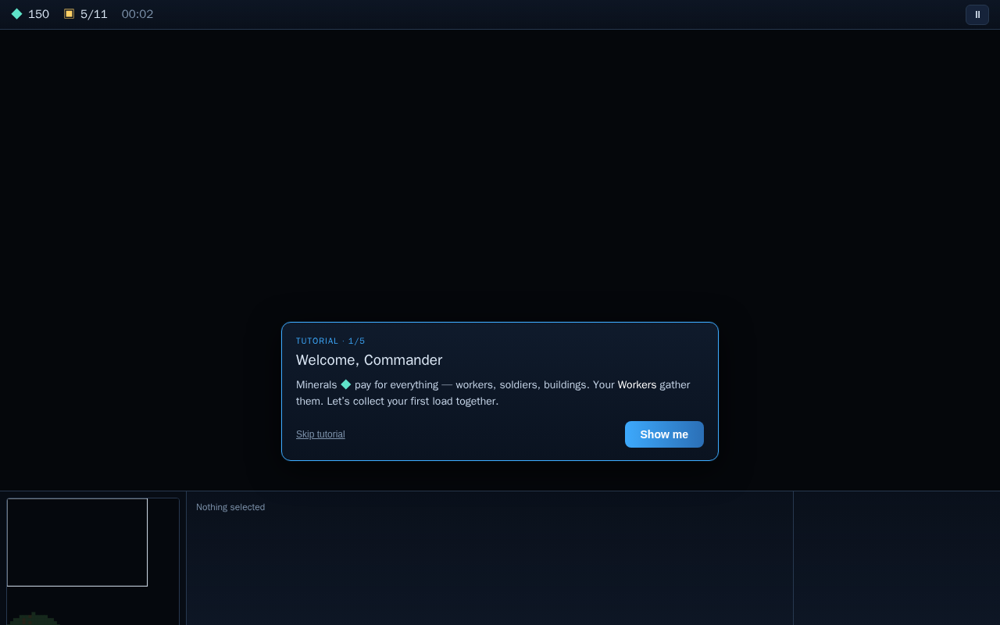

# Astro Command — a browser RTS

A polished, fully playable real-time strategy game built with **vanilla JavaScript + HTML5 Canvas**.
No frameworks, no build step, no external dependencies — just a tiny Node static server.

### ▶ [Play it now in your browser](https://fernforge.github.io/astro-command/)

No install required — runs entirely client-side on GitHub Pages.



## Run it locally

```bash
node server.js
# open http://localhost:8080
```

(or `npm start`)

## How to play

**Goal:** destroy the enemy's Command Center before they destroy yours.

| Action | Control |
| --- | --- |
| Select | Left-click, or drag a box. Shift-click to add. Double-click = all of that type on screen |
| Move / act | Right-click (move, attack, gather, or assist-build by context) |
| Attack-move | `A` then click |
| Move command | `M` then click |
| Stop / Hold | `S` / `H` |
| Control groups | `Ctrl`+`1‥9` assign · `1‥9` recall |
| Build (worker selected) | `E` Depot · `B` Barracks · `C` Factory · `T` Turret → then place |
| Produce (building selected) | `W` Worker · `E` Marine · `R` Ranger · `T` Tank |
| Camera | Arrow keys · screen-edge scroll · minimap · mouse-wheel zoom |
| Pause | `P` or `Esc` |

**Economy:** Workers mine ◆ minerals and return them to the Command Center. Build **Supply Depots**
to raise your population cap. Tech up: Barracks → Factory unlocks Rangers and Siege Tanks.

## Features

- Grid map generation with terrain, rock obstacles, and mineral expansions
- A* pathfinding + local steering/collision avoidance with stuck-recovery
- Economy: mineral harvesting, supply cap, build queues, rally points
- Worker-built structures with a live placement preview
- Units: Worker, Marine, Ranger, Siege Tank (splash). Buildings: Command Center, Depot,
  Barracks, Factory, Turret
- Combat: auto-target acquisition, projectiles, splash damage, armor, retaliation
- Fog of war (unexplored / explored / visible) with per-unit line of sight
- A genuine enemy **AI**: economy ramp, tech, army production, and escalating attack waves
  (Easy / Normal / Hard)
- Full HUD: resource bar, selection panel, contextual command card, live minimap with
  click-to-pan and right-click commands
- Procedural WebAudio sound effects (no asset files)
- Menus, pause, victory/defeat screens, particle effects, health bars, and pings

## Architecture (`src/`)

| File | Responsibility |
| --- | --- |
| `config.js` | Tuning constants + unit/building data |
| `util.js` | Math / vector / RNG helpers |
| `audio.js` | Procedural WebAudio sfx |
| `grid.js` | Tile map, terrain, occupancy, buildability |
| `pathfinding.js` | A* with a binary-heap open set |
| `camera.js` | World↔screen transform, pan/zoom |
| `input.js` | Mouse/keyboard event collection |
| `entities.js` | Unit / Building / Resource / Projectile / Particle |
| `fog.js` | Fog of war |
| `ai.js` | Enemy AI controller |
| `game.js` | Core simulation + all systems |
| `render.js` | World rendering |
| `ui.js` | HUD, command card, minimap |
| `main.js` | Bootstrap, input control, fixed-timestep loop |

## Tests

```bash
npm test
```

- `test/smoke.mjs` — headless simulation: economy, construction, AI build-up, win/lose.
- `test/dom-smoke.mjs` — stubs the browser DOM to drive `main.js` through 1200+ frames of the
  real render/UI/input loop with synthetic input, asserting zero runtime errors.
